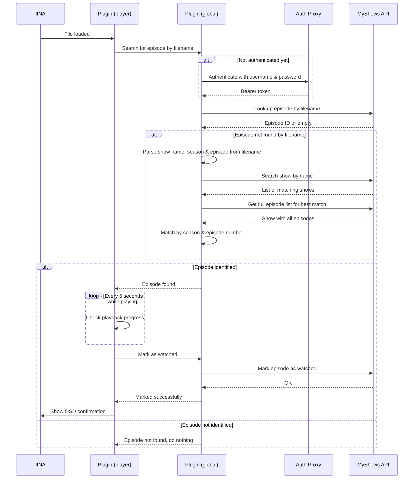

# IINA Plugin — MyShows

[English](README.md) | [Русский](README.ru.md)

Automatically marks TV show episodes and movies as watched in [MyShows](https://myshows.me) as you watch them in [IINA](https://iina.io).

## Features

- Detects the currently playing episode by sending the filename to the MyShows API
- Falls back to parsing the filename (show name + season/episode numbers) when the direct lookup fails
- Marks the episode as watched once playback reaches a configurable progress threshold (default: 70%)
- Shows an OSD confirmation when an episode is marked as watched

## Requirements

- [IINA](https://iina.io) 1.3.0 or later with plugin support enabled
- A [MyShows](https://myshows.me) account

## Installation

1. Open **IINA → Settings → Plugins** and click **Install from GitHub**
2. Paste `amiv1/iina-plugin-myshows` to the input and click **Install**
3. It will show what permissions the plugin requests, click **Install** again
4. **MyShows** should appear in the list of installed plugins, click on it
5. Open **Preferences** tab and enter your MyShows credentials
6. If you have video opened, reopen it or restart IINA

### Requested permissions

- **Network Request**: Used to make requests towards authentication proxy (configurable) and MyShows API
- **Show OSD**: To show when an episode has been marked as watched, if enabled in the preferences

## How It Works

1. First, the plugin uses authentication proxy by https://github.com/Igorek1986 to authenticate using provided MyShows credentials, the proxy encapsulates Client ID which is required for authentication to work but can't be exposed publicly
2. When a video file is loaded, the plugin extracts the filename and sends it to the MyShows API ([`shows.SearchByFile`](https://api.myshows.me/shared/doc/#!/shows/post_shows_SearchByFile))
3. If the API cannot identify the episode, the plugin parses the filename for a show name and season/episode pattern (e.g. `S01E03` or `1x03`) and searches via [`shows.Search`](https://api.myshows.me/shared/doc/#!/shows/post_shows_Search) + [`shows.GetById`](https://api.myshows.me/shared/doc/#!/shows/post_shows_GetById)
4. Once an episode is identified, playback progress is polled every 5 seconds during video playback
5. When progress reaches the configured threshold, [`manage.CheckEpisode`](https://api.myshows.me/shared/doc/#!/manage/post_manage_CheckEpisode) is called to mark the episode as watched



## Development

```sh
# Install dependencies
npm install

# Build
npm run build

# Run tests
npm test

# Write a conventional commit (used for automatic versioning)
npm run commit
```

### Releases

Releases are automated via [semantic-release](https://semantic-release.gitbook.io). Commits to `main` that follow the [Conventional Commits](https://www.conventionalcommits.org) format will automatically trigger a version bump, build, plugin packaging, and GitHub release.

| Commit type | Version bump |
|---|---|
| `fix:` | Patch (1.0.x) |
| `feat:` | Minor (1.x.0) |
| `feat!:` / `BREAKING CHANGE` | Major (x.0.0) |
