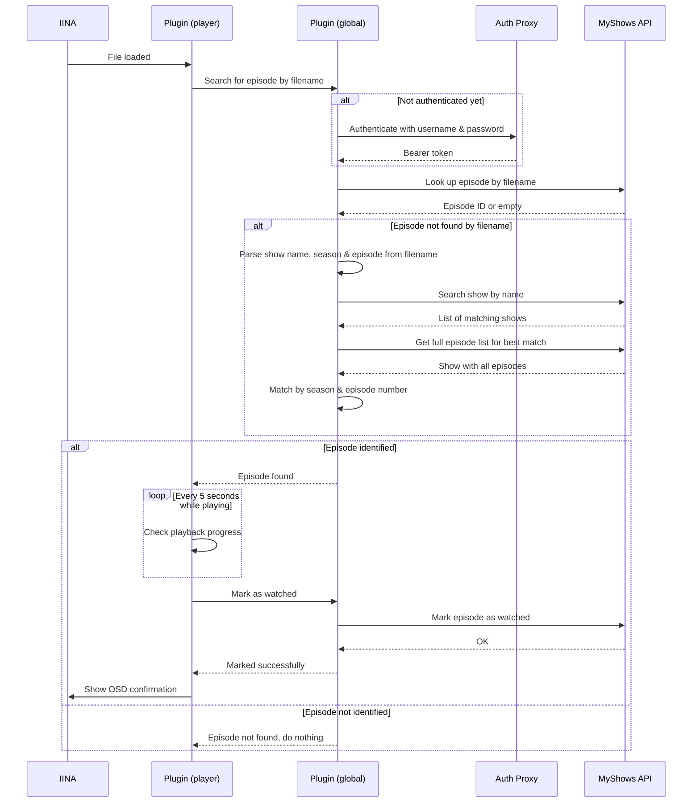

# IINA Plugin — MyShows

[English](README.md) | [Русский](README.ru.md)

Автоматически отмечает просмотренные серии сериалов и фильмы в [MyShows](https://myshows.me) во время просмотра в [IINA](https://iina.io).

## Возможности

- Определяет текущую серию, отправляя имя файла в MyShows API
- Если прямой поиск не дал результата, парсит имя файла (название сериала + номер сезона/серии)
- Отмечает серию как просмотренную, когда воспроизведение достигает настраиваемого порога (по умолчанию: 70%)
- Показывает сообщение на экране при отметке серии

## Требования

- [IINA](https://iina.io) 1.3.0 или новее с включённой поддержкой плагинов
- Аккаунт на [MyShows](https://myshows.me)

## Установка

1. Откройте **IINA → Настройки → Плагины** и нажмите **Установить с GitHub**
2. Введите `amiv1/iina-plugin-myshows` и нажмите **Установить**
3. Плагин покажет запрашиваемые разрешения — нажмите **Установить** ещё раз
4. **MyShows** появится в списке установленных плагинов — нажмите на него
5. Откройте вкладку **Настройки** и введите данные вашего аккаунта MyShows
6. Если видео уже открыто, переоткройте его или перезапустите IINA

### Запрашиваемые разрешения

- **Сеть**: для обращений к прокси аутентификации и MyShows API
- **Показывать сообщения на экране**: для отображения уведомления при отметке эпизода, если включено в настройках

## Как это работает

1. Плагин использует прокси аутентификации от https://github.com/Igorek1986, который хранит Client ID, необходимый для работы с MyShows API
2. При загрузке видеофайла плагин извлекает имя файла и отправляет его в MyShows API ([`shows.SearchByFile`](https://api.myshows.me/shared/doc/#!/shows/post_shows_SearchByFile))
3. Если API не смог найти серию, плагин парсит имя файла в поисках названия сериала и номера сезона/серии (например, `S01E03` или `1x03`) и выполняет поиск через [`shows.Search`](https://api.myshows.me/shared/doc/#!/shows/post_shows_Search) + [`shows.GetById`](https://api.myshows.me/shared/doc/#!/shows/post_shows_GetById)
4. После определения серии, каждые 5 секунд отслеживается прогресс воспроизведения
5. Когда прогресс достигает заданного порога, вызывается [`manage.CheckEpisode`](https://api.myshows.me/shared/doc/#!/manage/post_manage_CheckEpisode) для отметки эпизода как просмотренного



## Разработка

```sh
# Установить зависимости
npm install

# Собрать проект
npm run build

# Запустить тесты
npm test

# Создать коммит в формате conventional commits (используется для автоматического версионирования)
npm run commit
```

### Релизы

Релизы автоматизированы через [semantic-release](https://semantic-release.gitbook.io). Коммиты в ветке `main`, соответствующие формату [Conventional Commits](https://www.conventionalcommits.org), автоматически запускают обновление версии, сборку, упаковку плагина и создание GitHub-релиза.

| Тип коммита | Тип версии |
|---|---|
| `fix:` | Патч (1.0.x) |
| `feat:` | Минорная (1.x.0) |
| `feat!:` / `BREAKING CHANGE` | Мажорная (x.0.0) |
